# Open Challenges Platform - Visual Architecture

## Complete System Architecture

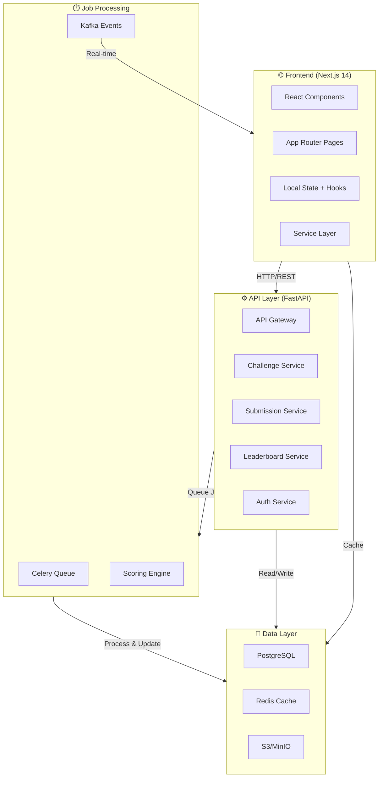

## Frontend Component Hierarchy

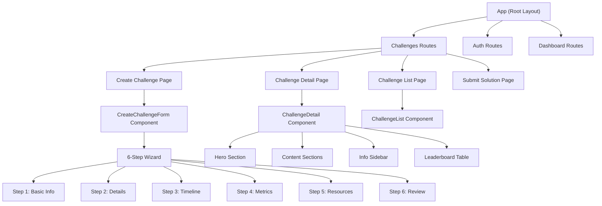

## Data Model Relationships

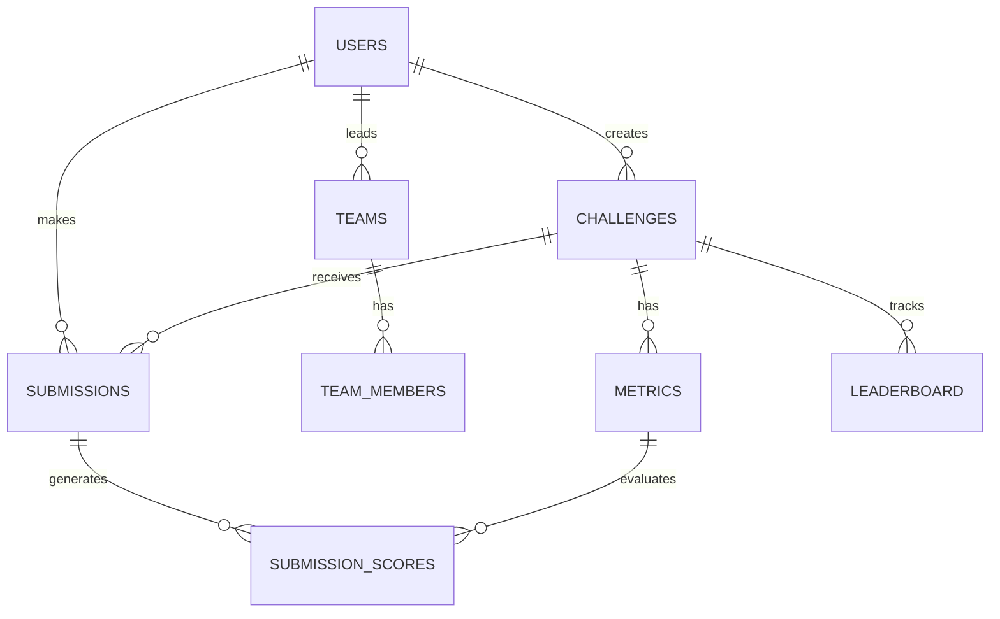

## Challenge Creation Data Flow

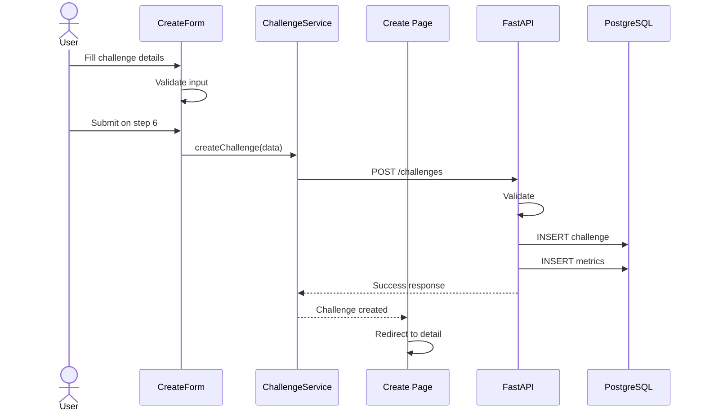

## Challenge Viewing Data Flow

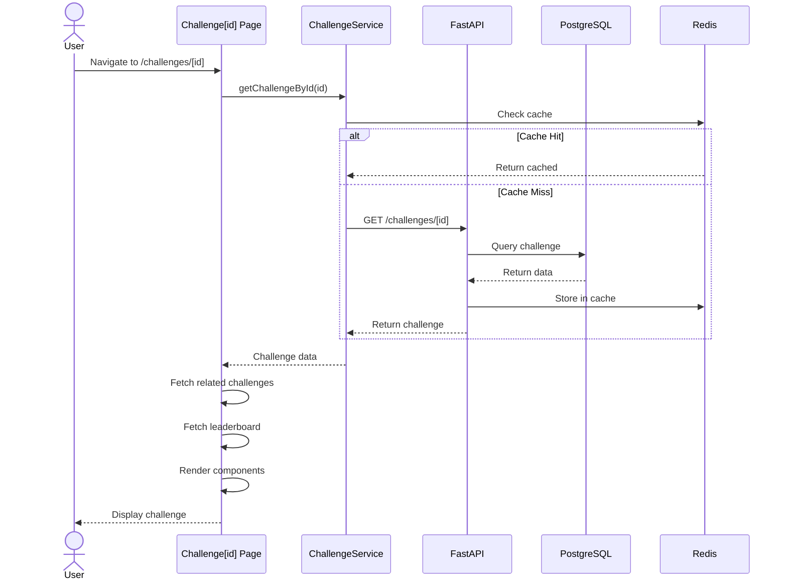

## Form State Management Flow

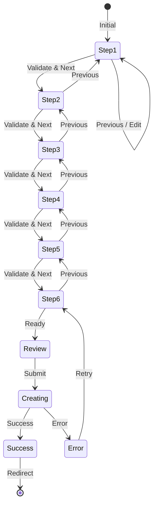

## Routing Map

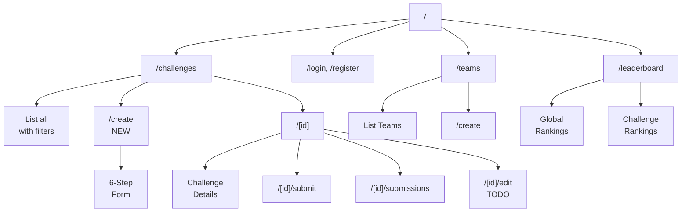

## Component Props Hierarchy

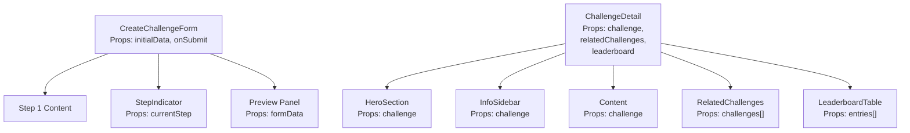

## Error Handling Flow

```mermaid
graph TD
    FormSubmit["Form Submit"]
    Validation["Validate Input"]
    
    Validation -->|Error| ValidationError["Show<br/>Validation Error"]
    Validation -->|Success| APICall["Call API"]
    
    APICall -->|Network Error| NetError["Show<br/>Network Error"]
    APICall -->|Server Error| ServerError["Show<br/>Server Error"]
    APICall -->|Success| Success["Success<br/>Redirect"]
    
    ValidationError --> FormSubmit
    NetError --> Retry["Retry?"]
    ServerError --> Retry
    Retry -->|Yes| APICall
    Retry -->|No| FormSubmit
    Success --> [*]
```

## Performance Optimization Strategy

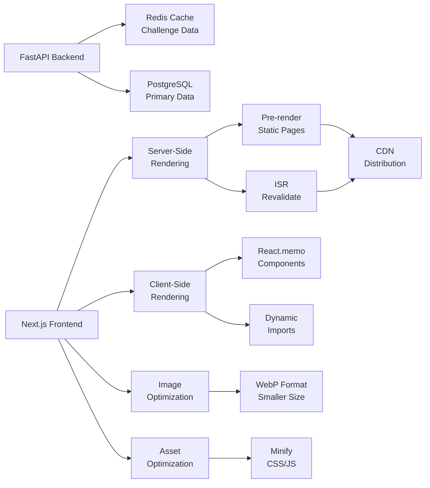

## Testing Strategy

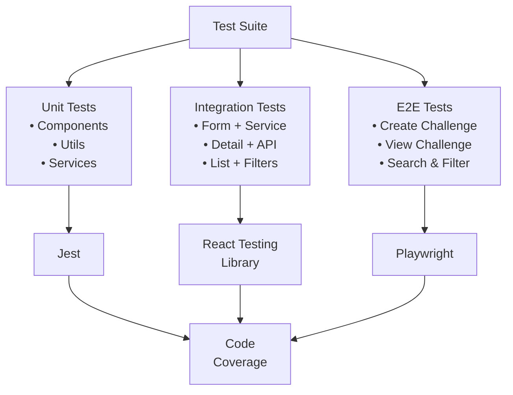

## Deployment Architecture

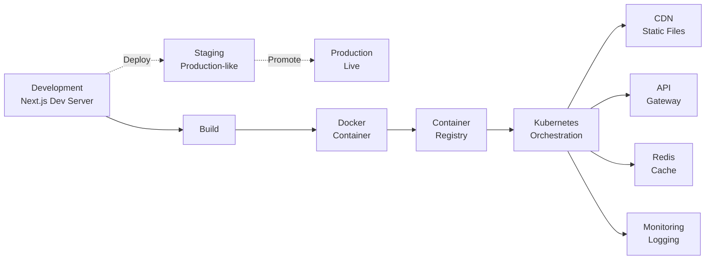

## API Response Caching Strategy

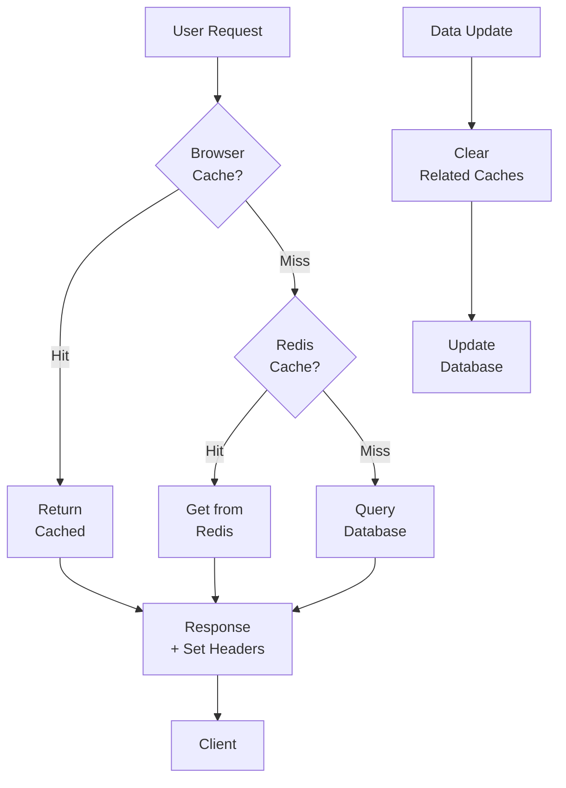

## Authentication Flow

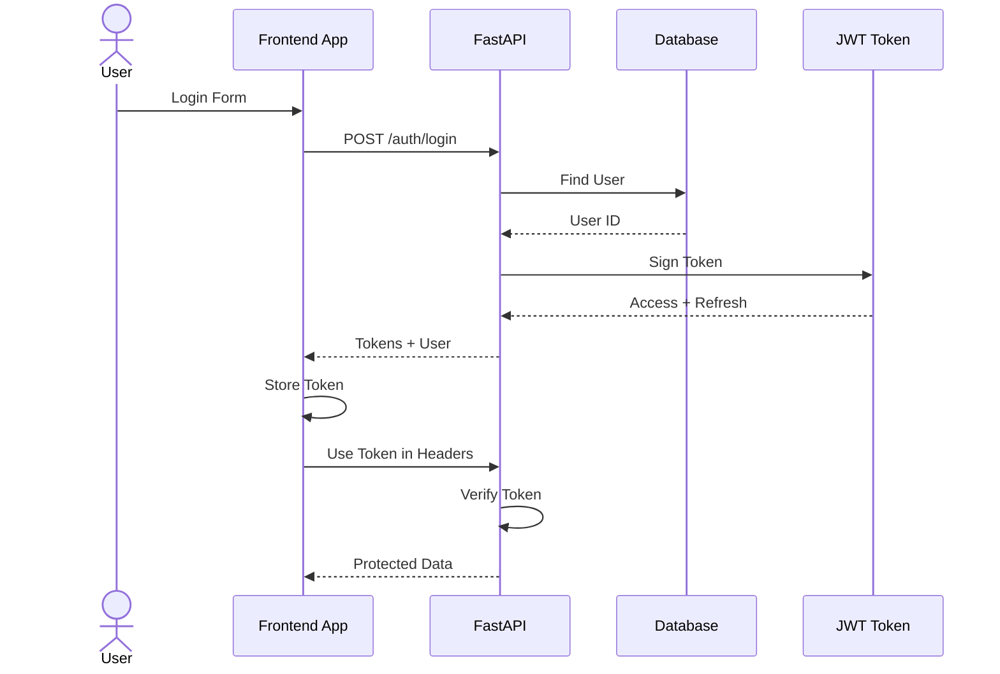

---

## Key Metrics & Performance Targets

```
Frontend Performance:
├── Page Load: < 2s
├── API Response: < 500ms
├── Image Load: < 1s
├── Form Interaction: < 100ms
└── Search/Filter: < 1s

Code Quality:
├── TypeScript Coverage: 100%
├── Component Test Coverage: > 80%
├── ESLint Score: 0 warnings
└── Bundle Size: < 300KB

User Experience:
├── Mobile Responsiveness: 100%
├── Accessibility: WCAG AA
├── Error Message Clarity: 100%
└── Form Success Rate: > 95%
```

---

## Technology Stack Overview

```mermaid
graph TB
    Frontend["FRONTEND"]
    Backend["BACKEND"]
    Data["DATA & INFRASTRUCTURE"]
    
    Frontend --> FE1["Next.js 14+"]
    Frontend --> FE2["React + TypeScript"]
    Frontend --> FE3["Tailwind CSS"]
    Frontend --> FE4["React Hooks"]
    
    Backend --> BE1["FastAPI"]
    Backend --> BE2["Python 3.10+"]
    Backend --> BE3["Pydantic"]
    Backend --> BE4["SQLAlchemy"]
    
    Data --> D1["PostgreSQL"]
    Data --> D2["Redis"]
    Data --> D3["Celery"]
    Data --> D4["Kafka"]
    Data --> D5["MinIO/S3"]
    
    Deploy["DEPLOYMENT"]
    Deploy --> Container["Docker"]
    Deploy --> Orbit["Kubernetes"]
    Deploy --> CDN["CDN"]
    Deploy --> Monitor["Prometheus/Grafana"]
```

---

*These diagrams provide a comprehensive visual representation of the Open Challenges Platform architecture, data flows, and component relationships.*
